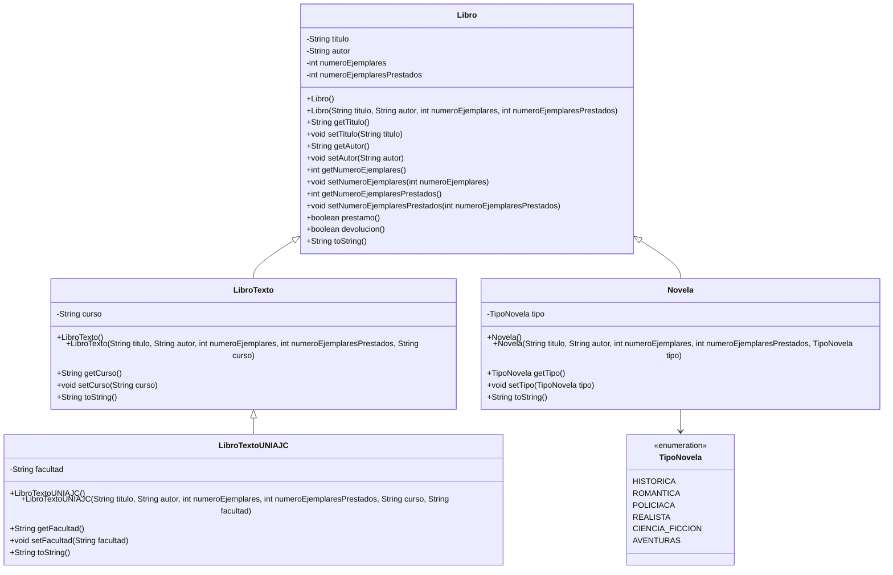

## Diagrama de clases (Mermaid)

Caso 1:
No se puede aplicar herencia entre Libro y Autor, porque un autor no es un tipo de libro. En este caso la relación sería de asociación, ya que un autor puede escribir uno o varios libros.

Caso 2:
No se puede aplicar herencia entre Libro y Préstamo, porque un préstamo no es una clase derivada de libro sino una acción que se realiza sobre él.

